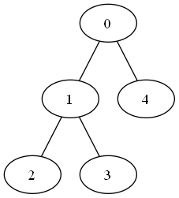
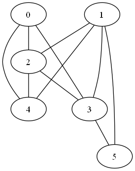

# Практика 3 и 4 по Теории графов

## Практика 3 — деревья и графы

### Пример дерева



[Исходник DOT](out/tree.dot)

### Пример графа



[Исходник DOT](out/graph.dot)

## Практика 4 — задача о назначениях

Венгерский алгоритм (`linear_sum_assignment` в `algorithm.py`) строит полное
паросочетание минимального (или максимального) веса в двудольном графе.
Отсутствующее ребро задаётся как `INF`, сложность — O(n²·m).

```python
from algorithm import INF, linear_sum_assignment

graph = [[4, 1, 3],
         [2, 0, 5],
         [3, 2, 2]]

linear_sum_assignment(graph)                 # (5, [1, 0, 2]) — минимум
linear_sum_assignment(graph, maximize=True)  # (11, [0, 2, 1]) — максимум
linear_sum_assignment([[1, INF], [2, 1]])    # (2, [0, 1]): ребро 0→1 отсутствует (INF)
```

Самопроверка: `venv/Scripts/python main.py` печатает `hungarian: ok`.
