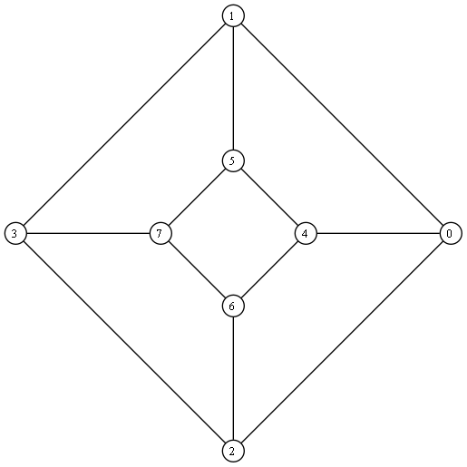
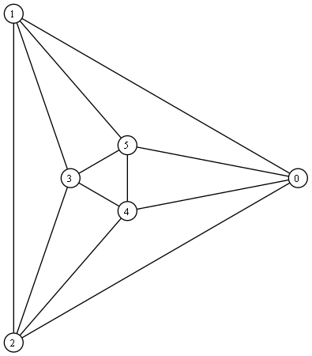
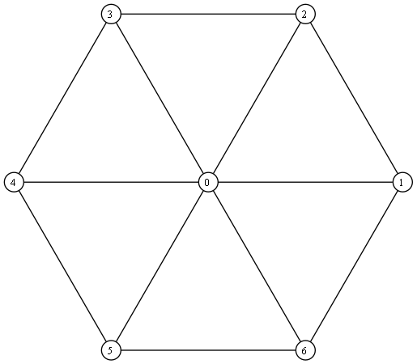

# Практика 3, 4 и 6 по Теории графов

## Практика 3 - деревья и графы

### Пример дерева


[Исходник DOT](out/tree.dot)

### Пример графа


[Исходник DOT](out/graph.dot)

## Практика 4 - задача о назначениях

Венгерский алгоритм (`linear_sum_assignment` в `algorithm.py`) строит полное
паросочетание минимального (или максимального) веса в двудольном графе.
Отсутствующее ребро задаётся как `INF`, сложность - O(n²·m).

```python
from algorithm import INF, linear_sum_assignment

graph = [[4, 1, 3],
         [2, 0, 5],
         [3, 2, 2]]

linear_sum_assignment(graph)                 # (5, [1, 0, 2]) - минимум
linear_sum_assignment(graph, maximize=True)  # (11, [0, 2, 1]) - максимум
linear_sum_assignment([[1, INF], [2, 1]])    # (2, [0, 1]): ребро 0→1 отсутствует (INF)
```

## Практика 6 - планарность и геометрическая укладка

Гамма-алгоритм (`check_planarity` в `algorithm.py`) проверяет планарность связного
графа: укладывает цикл, затем сегментами вставляет цепи в допустимые грани;
сегмент без допустимых граней - граф не планарен.

```python
from algorithm import check_planarity

check_planarity([[1, 3, 2], [0, 2], [0, 1, 3], [0, 2]])  # True - K4
check_planarity([[3, 4, 5], [3, 4, 5], [3, 4, 5],
                 [0, 1, 2], [0, 1, 2], [0, 1, 2]])       # False - K3,3
```

Геометрическая укладка Тутте (`tutte_embedding`): внешняя грань - правильный
многоугольник, внутренние вершины - барицентры соседей (уравнения Лапласа).



[Исходник DOT](out/tutte_cube.dot)



[Исходник DOT](out/tutte_octahedron.dot)



[Исходник DOT](out/tutte_wheel.dot)
